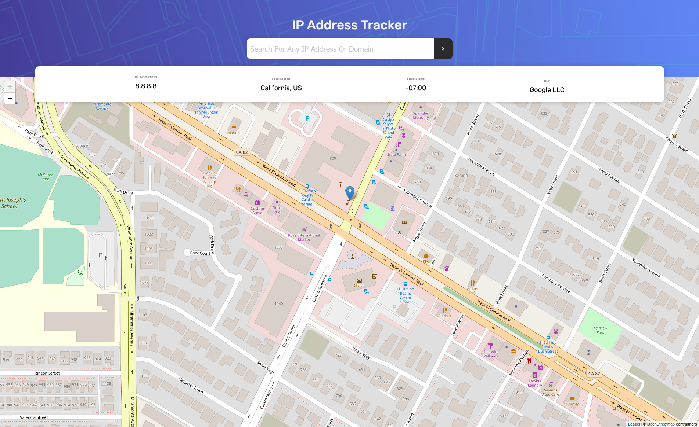
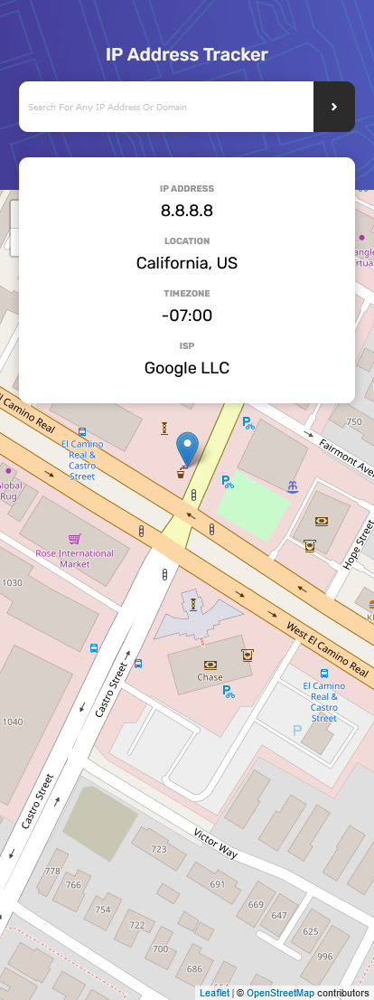

# Frontend Mentor - IP address tracker solution

This is a solution to the [IP address tracker challenge on Frontend Mentor](https://www.frontendmentor.io/challenges/ip-address-tracker-I8-0yYAH0). Frontend Mentor challenges help you improve your coding skills by building realistic projects.

## Table of contents

- [Overview](#overview)
  - [The challenge](#the-challenge)
  - [Screenshot](#screenshot)
  - [Links](#links)
- [My process](#my-process)
  - [Built with](#built-with)
  - [What I learned](#what-i-learned)
  - [Continued development](#continued-development)
  - [Useful resources](#useful-resources)
- [Author](#author)
- [Acknowledgments](#acknowledgments)

## Overview

### The challenge

Users should be able to:

- View the optimal layout for each page depending on their device's screen size
- See hover states for all interactive elements on the page
- See their own IP address on the map on the initial page load
- Search for any IP addresses or domains and see the key information and location

### Screenshot




### Links

- Solution URL: [FrontEndMentor](https://www.frontendmentor.io/challenges/ip-address-tracker-I8-0yYAH0/hub/html5-css-sass-flexbox-vainilla-javascript-leaflet-MpEmqHpAk)
- Live Site URL: [https://hidalest.github.io/ipAddressTracker/](https://hidalest.github.io/ipAddressTracker/)

## My process

I started by doing a flow chart on how and what does the application should do, this overview of the application helps me divide the problem into small problems allowing me to focus on them instead of thinking of the whole project as one big problem.

After I have my flowchart and start adding all the tools necessary and planning the SASS files as well as creating the HTML structure that the application will have. After that start coding!!! <3

### Built with

- Semantic HTML5 markup
- CSS custom properties
- Flexbox
- CSS Grid
- Mobile-first workflow
- SCSS
- Vainilla JS
- Leaflet (for mapping)
- Loading.css (for loading spinner animation).

### What I learned

This project was awesome, although it was hard it helped develop my investigations skills.
This was the first project with Geolocation and mapping features, I had to read a LOT the documentation of Leaflet, search on blogs, and look at youtube videos. Also, I learned API calls with promises a little bit ago and since in this project we needed to use an API for the IP address then it was an awesome opportunity to practice this.

This is my second project using OOP, and I starting to feel more comfortable with this, although I still have some scoping issues I felt better than my last project (ToDo app).

I wanted to add some extra features that I didn't know about for example: Adding a loading spinner when the API is being called, I looked online on how to do it and it was way easier than I thought it would be. Also wanted to implement validation on the input to detect if the input was an IP address or Domain and I find online that Regex is a great option for this (although IPv6 doesn't work).

- Responsive Design Mixins

Proud of this CSS code:

```css
$phone-mini: 320px;
$phone: 480px;
$table: 768px;
$table-land: 1024px;
$desktop: 1800px;

@mixin responsiveMax($breakpoint) {
  @media (max-width: $breakpoint/16px*1em) {
    @content;
  }
}
@mixin responsiveMin($breakpoint) {
  @media (min-width: $breakpoint/16px*1em) {
    @content;
  }
}
```

Proud of this JS code:

```js

    _getJSON(url) {
    inputIP.value = "";
    spinner.classList.remove("hide");
    return fetch(url).then((response) => {
      spinner.classList.add("hide");
      if (!response.ok) {
        throw new Error(`${response.status}`);
      }
      return response.json();
    });
  }

  _getInfo(type, data) {
    return this._getJSON(
      `https://geo.ipify.org/api/v1?apiKey=at_NgGttAYTDFqu165ikDdSyZw5hNeP4&${type}=${data}`
    )
      .then((data) => {
        if (!data) {
          throw new Error("No data found");
        } else this._ipInfo = data;

        this._updateMapInfo(data);
      })
      .catch((err) => {
        swal(
          `Information entered is not valid, error(${err.message})`,
          "Please enter a valid IP adress or Domain",
          "warning"
        );
      });
  }
};
```

### Continued development

I still need to practice my scoping, doing this project I was stuck on some points due to the "this" keyword was not pointing to the right object. Need to read more documentation to understand it better.

I noticed that regex is pretty useful, still, I don't feel comfortable using them so I will read more documentation on its basics and different scenarios.

Much to improve and more to practice

### Useful resources

- [Leaflet Docs](https://leafletjs.com/reference-1.7.1.html) - Sometimes they are confusing to understand but I by reading careful I was able to accomplish some desire features of the project with their documentation.
- [Stackoverflow](https://stackoverflow.com/) - Whenever I have a random question, issue, etc. This is where I go and youtube.

## Author

- Github Profile - [hidalest](https://github.com/hidalest)
- Frontend Mentor - [@hidalest](https://www.frontendmentor.io/profile/hidalest)
